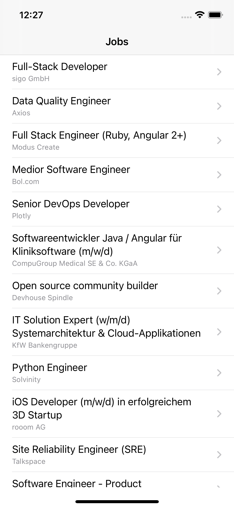
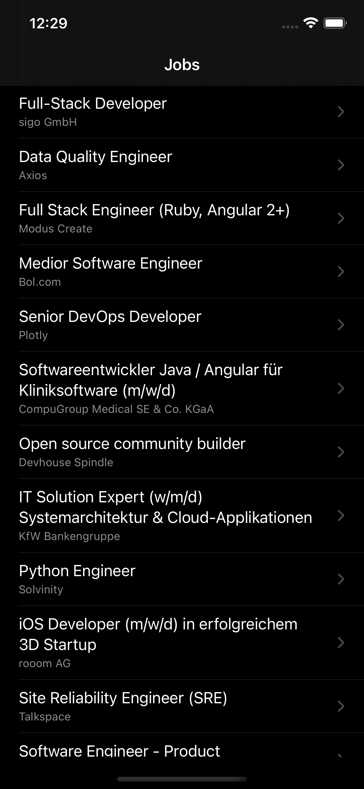
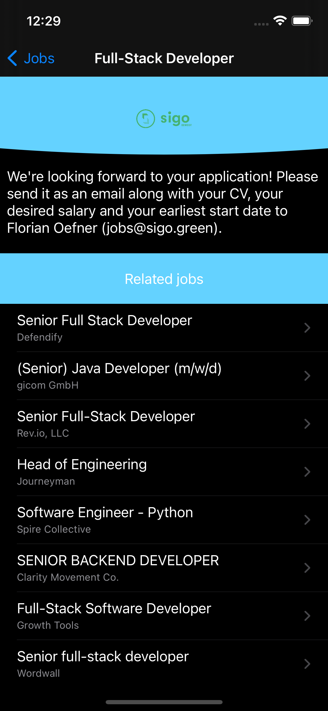
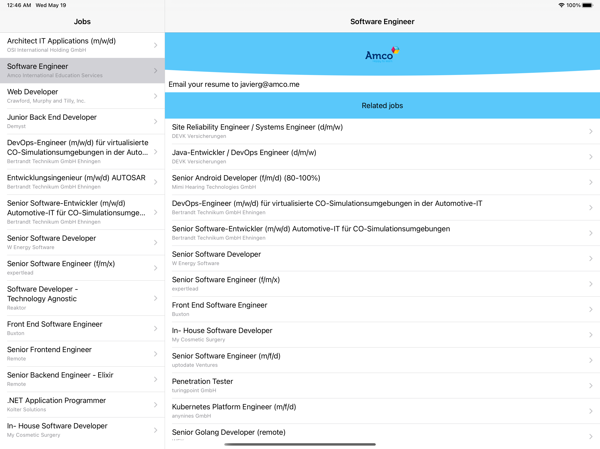
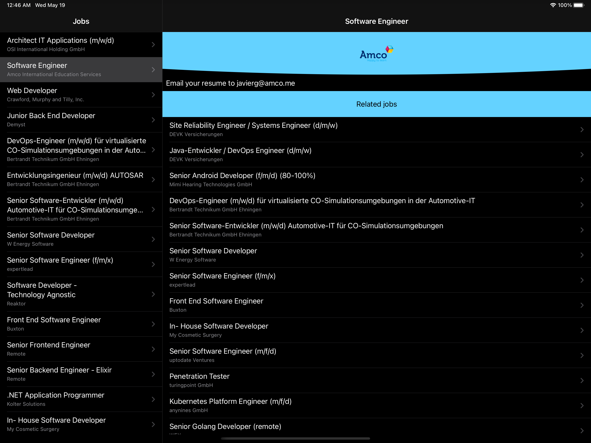

# Github Jobs App

Simple universal app written in Swift 5 using the Github Jobs API: https://jobs.github.com/api

## Screenshots

 
 

### iPadOS

 

## Third-party libraries

### Kingfisher (https://github.com/onevcat/Kingfisher)
Used for downloading and caching images. In the app, it is used to show the company's logo.

## Contributing

Feel free to open an issue or submit a pull request if you have any improvement or feedback.

## Author

Alonso Alvarez, alonso.alvarez.dev@gmail.com
